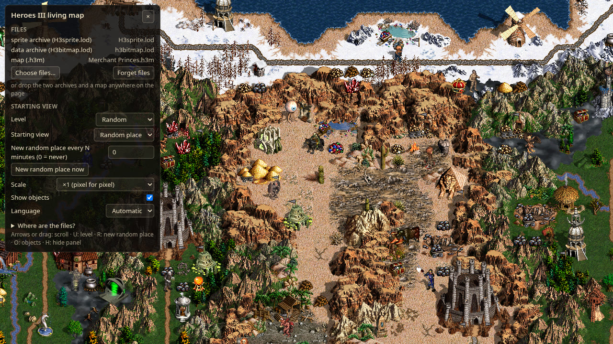
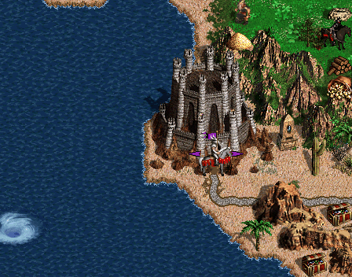
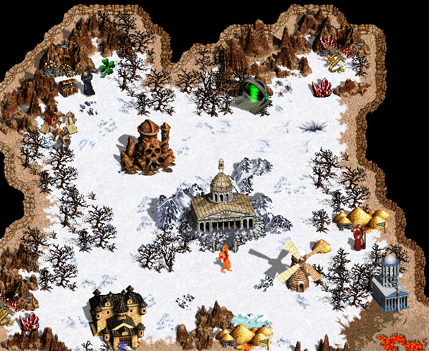

# Heroes 3 Living Map

An animated **Heroes of Might and Magic III** adventure map for your desktop or your browser. The
map is drawn from your own copy of the game: terrain, rivers, roads, objects, heroes and towns,
with the animation the original game uses.

It runs as a live wallpaper in **Wallpaper Engine**, **Lively Wallpaper** and **KDE Plasma 6**, and
as a plain web page.



> Fan project, not affiliated with the game's publishers. **No game files are included:** you
> supply them from your own installation, and they never leave your computer.

## What it does

- Reads the original game files directly: `H3sprite.lod`, `H3bitmap.lod` and any `.h3m` map of
  Restoration of Erathia, Armageddon's Blade, Shadow of Death or **Horn of the Abyss** (with
  `HotA.lod` from a HotA installation).
- Draws the map the way the game does: the same tiles, mirroring, draw order, flag colours,
  shadows, 16-bit colour, and water, lava and river animation at the game's 180 ms step. HotA maps
  get HotA's own look: Highlands and Wasteland, five town forms per faction, and shadows tinted by
  the soil an object stands on. Checks compare the output pixel by pixel with screenshots taken
  from the original game (the Complete edition, and HotA for HotA maps).
- Animates everything the game animates: palette cycling for water and rivers, frames for
  windmills, whirlpools, flags and creatures.
- Shows a random place on the map, the map centre or chosen coordinates. It can move to a new
  random place every N minutes, on either level.
- Takes one map or a whole **folder of maps** (or a `.zip` of them): a random map at every start,
  optionally a new one every N minutes, filtered by map size and by underground.
- Uses little of your computer. It draws a frame only when something on screen changes (about 5
  times a second) and stops completely when the wallpaper is covered, paused or hidden. Decoded
  data is cached, so later starts take one to two seconds.

<table>
  <tr>
    <td></td>
    <td></td>
  </tr>
  <tr>
    <td align="center">Palette and frame animation</td>
    <td align="center">Underground level (Shadow Valleys)</td>
  </tr>
</table>

## Status

This is an early release. Base-game and HotA maps render; save games and interactive extras are
planned (see [Roadmap](#roadmap)). What changed in each version: [CHANGELOG.md](CHANGELOG.md).

| Host | State |
| --- | --- |
| Browser | Works. Tested in Chromium-based browsers. |
| KDE Plasma 6 | Works. Accepted on a real Plasma 6 session (Fedora 43, three screens, fractional scaling). |
| Wallpaper Engine | Works. Checked on Windows (2026-09-19; HotA and folders of maps 2026-09-25). |
| Lively Wallpaper | Works. Checked on Windows (2026-09-19; HotA and folders of maps 2026-09-25). |

## You need the game

You need an installed copy of **Heroes of Might and Magic III Complete**.
The wallpaper needs three files from it, and a fourth for HotA maps:

| File | Where | What for |
| --- | --- | --- |
| `H3sprite.lod` | `Data` folder of the game | terrain, object, hero and town sprites |
| `H3bitmap.lod` | `Data` folder of the game | object table and colours; without it only the terrain is drawn |
| a map `*.h3m` | `Maps` folder of the game (or any downloaded map) | the map to show |
| `HotA.lod` | `Data` folder of a **Horn of the Abyss** installation (1.8) | only for HotA maps: HotA terrains, towns and objects |

File names do not matter: files are recognised by their contents. A HotA map without `HotA.lod`
still opens, but without HotA's terrains and objects. WoG and Chronicles maps are not supported yet
and show a message.

## Getting started

| Host | Where to get it |
| --- | --- |
| Browser | **<https://alamion.github.io/heroes_III_ts/>**, nothing to install |
| Wallpaper Engine | [Steam Workshop](https://steamcommunity.com/sharedfiles/filedetails/?id=3808342201), or the `wallpaper-engine` archive of the [latest release](https://github.com/Alamion/heroes_III_ts/releases/latest) |
| Lively Wallpaper | the `lively` archive of the [latest release](https://github.com/Alamion/heroes_III_ts/releases/latest) |
| KDE Plasma 6 | [KDE Store](https://store.kde.org/p/2374098/) ("Get New Plugins…" in the wallpaper settings), or the `kde` archive of the [latest release](https://github.com/Alamion/heroes_III_ts/releases/latest) |

Every release lists its files with checksums (`SHA256SUMS`).

### In the browser

Open **<https://alamion.github.io/heroes_III_ts/>**, then click **Choose files…** or drop the
archives and a map anywhere on the page (several files at once are fine). The files are read locally; nothing is uploaded. The
browser remembers them for your next visit, and **Forget files** removes them.

| Key | Action |
| --- | --- |
| Arrows, mouse drag | scroll |
| `U` | switch level (surface / underground) |
| `R` | new random place |
| `N` | next map (with a folder of maps) |
| `O` | show or hide objects |
| `H` | hide or show the panel |

The panel hides itself after a few seconds without mouse movement.

For a **folder of maps**, set **Map source** to *Folder of maps* and click **Choose folder…**, or drop
a folder (or a `.zip` of maps) onto the page. Only the `.h3m` files are used, sub-folders included;
the browser remembers them like the other files.

### Wallpaper Engine, Lively, KDE Plasma

Take the package from the [Getting started](#getting-started) table: the stores install it for you;
the release archives are named `heroes3-living-map-<host>-<version>`. To build them yourself, see
[Building from source](#building-from-source) (`yarn package` writes them to `dist/packages/`).

**Wallpaper Engine** (Windows)
1. Subscribe on the [Steam Workshop](https://steamcommunity.com/sharedfiles/filedetails/?id=3808342201),
   or unpack `heroes3-living-map-wallpaper-engine-<version>.zip` into a new folder under
   `Wallpaper Engine/projects/myprojects/` (or open its `project.json` in the Wallpaper Engine editor).
2. Select the wallpaper, open its properties and choose the files in **Sprite archive**, **Data
   archive** and **Map** (and **HotA archive** for a HotA map).
3. For a folder of maps: Wallpaper Engine cannot list a folder, so zip the maps (for example the
   game's `Maps` folder) into `game/maps.zip` inside the wallpaper's folder and set **Map source** to
   *Folder of maps*; **Folder of maps** already says `game/maps.zip`.

**Lively Wallpaper** (Windows)
1. Drag `heroes3-living-map-lively-<version>.zip` (from the release) into Lively.
2. Open **Customise** for the wallpaper and use **Browse** in the file settings. Lively copies
   the chosen files into the wallpaper's folder. The HotA archive is only needed for HotA maps.
3. For a folder of maps: Lively copies single files only, so zip the maps (for example the game's
   `Maps` folder) and choose the `.zip` in **Folder of maps**, with **Map source** set to *Folder of maps*.

**KDE Plasma 6** (Linux)
1. Install the plugin from the [KDE Store](https://store.kde.org/p/2374098/) (right-click the desktop →
   **Configure Desktop and Wallpaper** → **Get New Plugins…**), or from the release archive:
   ```bash
   kpackagetool6 -t Plasma/Wallpaper -i heroes3-living-map-kde-<version>.tar.gz
   # later updates: -u instead of -i
   ```
   It needs Qt WebEngine for QML: Fedora `qt6-qtwebengine`, Debian/Ubuntu `qml6-module-qtwebengine`,
   Arch `qt6-webengine` (without it the wallpaper shows this message instead of the map).
2. Right-click the desktop → **Configure Desktop and Wallpaper** → wallpaper type **Heroes 3 Living Map**.
3. Choose the files (the HotA archive only for HotA maps) and press **Apply**.
4. For a folder of maps: set **Map source** to *Folder of maps* and choose the folder (for example
   the game's `Maps` folder) or a `.zip` of maps.

The map pauses while a maximised or full-screen window covers the screen. The lock screen shows a
plain dark background.

### Settings

Every host shows the same settings, in English or Russian:

| Setting | Values | Default |
| --- | --- | --- |
| Map source | one map, folder of maps | one map |
| New map every N minutes | 0–1440, 0 = only at start; counts only while the wallpaper is visible | 0 |
| Smallest / largest map size | S (36×36) … G (252×252) | S / G |
| Underground | any map, only with underground, only without | any |
| Next map now | button | — |
| Level | random, surface, underground | random |
| Starting view | random place, map centre, coordinates (X/Y in % of the map) | random place |
| New random place every N minutes | 0–1440, 0 = never | 0 |
| New random place now | button | — |
| Scale | ×1 pixel for pixel, ×2 (as in the original game), ×3 | ×1 |
| Show objects | on / off | on |

Changes apply immediately, without reloading the files. The folder settings are shown only with the
folder source (Lively shows them always and says so). A map switch keeps the old map on screen until
the new one is ready; maps do not repeat until every map of the folder was shown, and maps that
cannot be read are skipped.

## Building from source

Requirements: Node.js 22+, Yarn 1, and for the checks a Chromium browser
(`/usr/bin/chromium-browser`, or set `H3_CHROMIUM`). Development is done on Linux.

```bash
yarn install
yarn dev                 # dev page: pick the files, scroll with arrows or drag
yarn test                # unit tests (tests that need real game files are skipped without them)
yarn build               # type-check and build
yarn package --host all  # packages in dist/packages/
yarn preview:web         # serve the browser version as GitHub Pages does
```

To run the tests and checks on real files, put your game files in `public/dev-assets/` (the folder
is git-ignored). [AGENTS.md](AGENTS.md) lists every command, including inspection tools
(`yarn h3 …`) and headless checks (`yarn verify …`).

## Documentation

- [docs/architecture.md](docs/architecture.md): how it works inside. File formats, rendering,
  animation, the hosts, how fidelity is checked, and the hard problems with the decisions made. Start
  here if you want to learn from the code or reuse parts of it.
- [AGENTS.md](AGENTS.md): development guide with commands, layout and rules.
- [.specify/memory/constitution.md](.specify/memory/constitution.md): project principles (user
  files only, fidelity to the original, performance budgets).
- [specs/](specs/): feature specifications with research notes and measurements:
  [reference environment](specs/001-reference-environment/),
  [foundation](specs/002-foundation-rewrite/), [map objects](specs/003-map-objects/),
  [platform adapters](specs/004-platform-adapters/), [HotA support](specs/005-hota-support/),
  [releases and publishing](specs/006-release-publishing/), [map folder](specs/007-map-folder/).
- [CHANGELOG.md](CHANGELOG.md): what changed in each release; [docs/releasing.md](docs/releasing.md):
  how a release is made and the stores are updated.
- [TODO.md](TODO.md): roadmap and open items.
- [THIRD_PARTY_NOTICES.md](THIRD_PARTY_NOTICES.md): attribution.

## Roadmap

1. One map across several screens; the lock screen.
2. Save games of the Complete edition.
3. Interactive extras: scrolling on idle, battles, captured towns and mines.

Horn of the Abyss maps and archives are done ([spec 005](specs/005-hota-support/)), and so is a
folder of maps with rotation and filters ([spec 007](specs/007-map-folder/)).

## Feedback

Suggestions and bug reports go to [GitHub Issues](https://github.com/Alamion/heroes_III_ts/issues/new/choose)
(English or Russian). Comments and reviews on the store pages are not tracked.

## Credits and prior work

This project stands on the work of others:

- **[h3lwp](https://github.com/IlyaPomaskin/h3lwp)** by Ilya Pomaskin, a Heroes III live wallpaper
  for Android. It inspired this project and was the first reference for how the file formats,
  terrain draw order and palette animation work. The repository has no license, so **none of its
  code was copied**; it was only studied. Some of its values turned out to differ from the game
  (river palette ranges, animation direction), see the specs.
- **[homm3-parser](https://github.com/srg-kostyrko/homm3-parser)** by Sergey Kostyrko (MIT). The
  H3M map layouts were ported from it into new bounds-checked readers, with attribution in
  [THIRD_PARTY_NOTICES.md](THIRD_PARTY_NOTICES.md). homm3-parser itself builds on the homm3tools
  H3M format description.
- **[VCMI](https://github.com/vcmi/vcmi)**, the open-source Heroes III engine (GPL). Its source was
  consulted to cross-check map layouts and object behaviour. **No VCMI code was copied**, which the
  GPL would not allow in an MIT project.
- For Horn of the Abyss: **[hota-lod-convert](https://codeberg.org/DarkAtom/hota-lod-convert)**
  (MIT/Apache) for the HotA 1.8 archive layout, **[FreeHeroes](https://github.com/mapron/FreeHeroes)**
  (MIT) and **[h3m2json](https://github.com/HeroWO-js/h3m2json)** (public domain) for the HotA map
  format, **[MMArchiveCLI](https://github.com/imahero1492/MMArchiveCLI)** (MIT) for HotA sprite
  quirks, and the configuration of VCMI's HotA mod (CC BY-SA). Details and attribution are in
  [THIRD_PARTY_NOTICES.md](THIRD_PARTY_NOTICES.md). HotA's shadow tints were measured against the
  game itself.
- The [Wallpaper Engine documentation](https://docs.wallpaperengine.io/) for web wallpapers.

Every visual rule was then measured against the original game running under Wine (see
[docs/architecture.md](docs/architecture.md#checking-against-the-original-game)).

## License

The source code and original artwork (icon, package previews) are under the [MIT license](LICENSE).

Heroes of Might and Magic III and its content belong to their rights holders. This repository and
its packages contain no game files. The screenshots in [docs/img/](docs/img/) show this program's
output from the owner's copy of the game and are included for illustration only.
