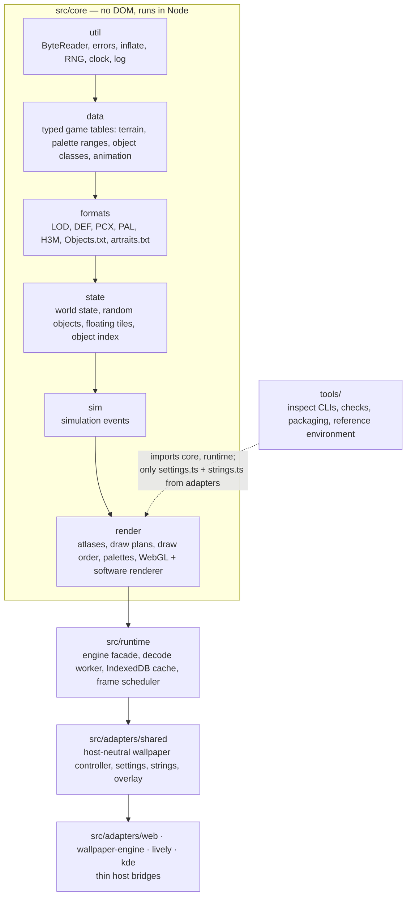
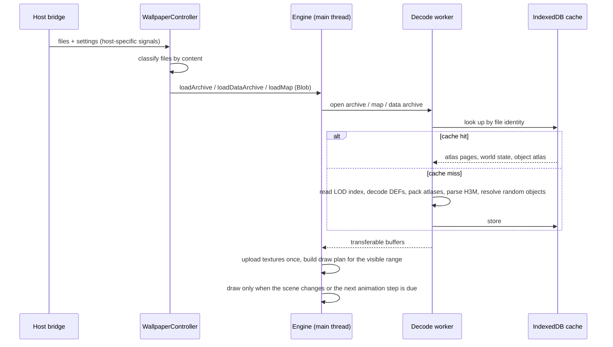
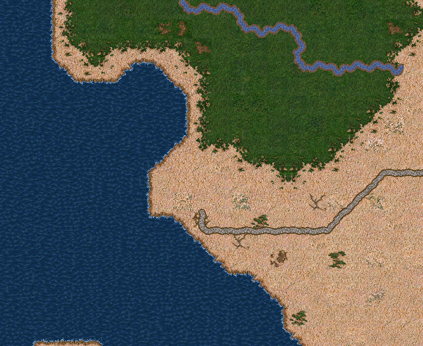
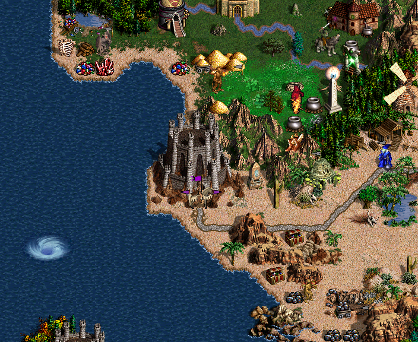
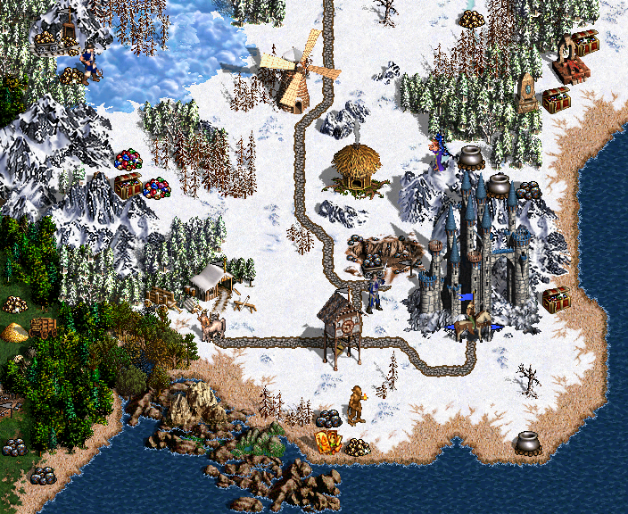
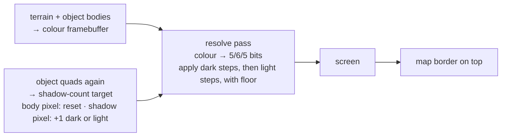
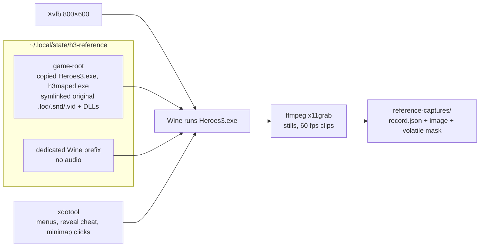

# How H3 Living Map works

This document is for developers who want to understand the code, fix something, or reuse parts of
it in their own project. It explains the architecture, then goes through the problems that were
not obvious, what was measured, and which solution was chosen and why.

The research notes in [specs/](../specs/) are the primary record, with every measurement and the
dead ends. This document summarises them and points to the code.

Contents:

1. [The big picture](#the-big-picture)
2. [File formats](#file-formats)
3. [From map to world state](#from-map-to-world-state)
4. [Rendering terrain](#rendering-terrain)
5. [Palette animation](#palette-animation)
6. [Rendering objects](#rendering-objects)
7. [Runtime: worker, cache, frame scheduling](#runtime-worker-cache-frame-scheduling)
8. [Wallpaper hosts](#wallpaper-hosts)
9. [Checking against the original game](#checking-against-the-original-game)
10. [Known deviations and open questions](#known-deviations-and-open-questions)
11. [Reusing the code](#reusing-the-code)

---

## The big picture

### Goals that shaped every decision

The [constitution](../.specify/memory/constitution.md) sets the rules. Four of them drive most of
the design:

- **No game content in the repository or packages.** The user supplies the files at run time. Even
  flag colours are stored as palette entry numbers and read from the user's `game.pal`.
- **Look like the original.** The baseline is the unmodified Complete edition (`Heroes3.exe`), not
  HD Mod or HotA. Every visual rule is checked against screenshots of the real game.
- **Work scales with the screen, not the map.** A 252×252 two-level map uses the same GPU memory,
  draw calls and CPU per frame as a 36×36 one. A wallpaper runs all day, possibly on an Intel HD
  3000-class GPU; an earlier proof of concept sized textures to the map and crashed the machine.
- **Everything is checkable headlessly.** Rendering is a pure function of (files, camera, time,
  seed), so an agent or CI can reproduce any frame and diff it.

### Stack

- TypeScript (strict, `erasableSyntaxOnly`), **no runtime dependencies**.
- Raw **WebGL 1.0**, no extensions required.
- The platform's `DecompressionStream` for zlib/gzip, IndexedDB for the cache, a Web Worker for
  decoding.
- Dev only: Vite, Vitest, `playwright-core` driving the system Chromium with SwiftShader, so
  screenshots are identical on any GPU.

Rejected alternatives ([002 research §1](../specs/002-foundation-rewrite/research.md)):

| Candidate | Why not |
| --- | --- |
| Pixi.js | ~100 KB+ gzipped, alone over the 100 KB runtime budget; no palette-lookup shaders; its sprite-per-tile model led the proof of concept to re-bake textures on every animation step |
| Preact | the UI is a file picker and a status line; nothing to render declaratively |
| twgl / regl | one shader program does not need a wrapper |
| fflate / pako | every target host has `DecompressionStream` |
| WebGL 2 | not guaranteed on the minimum GPU class |

The whole runtime is 56–59 KB of gzipped JavaScript per package, decode worker included.

### Layers

Code imports only downwards; `yarn verify layers` enforces it with the TypeScript compiler API, and
`tsconfig.core.json` compiles the lower layers without DOM or Node types.



### Data flow at start-up



---

## File formats

All parsers live in [src/core/formats/](../src/core/formats/). They share a bounds-checked
[`ByteReader`](../src/core/util/byte-reader.ts) and fail with a typed
[`FormatError`](../src/core/util/errors.ts) that carries `{code, file, offset, format, structure,
version}`. `reader.scope('players[3].mainTown', …)` builds the structure path, so an error names
exactly what was being read.

**The rule: never guess bytes.** Documented unknown bytes are skipped with `skipKnown(n, what)`,
padding that must be zero is read with `zeros(n, what)`, and an unknown object class is an explicit
`unsupported` error. This matters because thousands of community maps exist. A silent misalignment
turns into garbage objects much later in the file, which is far harder to debug than an error at
the byte where the assumption broke.

### LOD archives — [lod.ts](../src/core/formats/lod/lod.ts)

- Header: magic `LOD\0`, version (200 in the base game), entry count at offset 8, index at offset 92.
- Index entries are 32 bytes: `name[16], offset, size, type, compressedSize`. A compressed size of
  0 means the entry is stored raw; otherwise it is zlib.
- Lookup is case-insensitive. On duplicate names the first wins and a warning is recorded.
- **Range reads.** Only the header and index are read up front. Entries are read through a
  [`ByteSource`](../src/core/util/byte-source.ts): `File.slice` in the browser, a file handle in
  Node, memory in tests. The 64 MB `H3sprite.lod` is never loaded whole.
- HotA 1.8+ archives (byte 12 = 135, encrypted index) are rejected with `UNSUPPORTED_VERSION`.

### DEF sprites — [def.ts](../src/core/formats/def/def.ts)

A DEF has a header, a 256-colour palette, groups of frames, and per-frame headers. Frames are
decoded **to palette indices**, never to RGB. Palette animation, player colours and shadows are
then applied later on the GPU without re-decoding.

| Compression | Encoding |
| --- | --- |
| 0 | raw indices |
| 1 | u32 row offsets; runs of `(index, length−1)`; index `0xFF` = literal run |
| 2 | one u16 offset; code byte: `index = code >> 5`, `length = (code & 0x1F) + 1`; index 7 = literal run |
| 3 | as 2, but a u16 offset table with `width/32` entries per row |

Traps:

- **Old-format headers.** A compression-1 frame whose `w > fullW && h > fullH` actually has a
  16-byte header. Use the full size, `x = y = 0`, data at offset + 16.
- **Frame indices span groups.** A map tile's "view" index addresses all frames of all groups
  joined in file order (`frameOrder`). The proof of concept read only group 0 and picked wrong
  tiles.
- **Shared frames.** Frame headers are cached by offset, so frames used by several groups go into
  the atlas once.
- **Special palette indices** (not colours): 0 transparent, 1–4 and 6–7 shadow, 5 player flag.
  Terrain uses none of them. River, road and border overlays treat 1–7 as partial transparency.

### PCX images — [pcx.ts](../src/core/formats/pcx/pcx.ts)

`u32 size, width, height`. `size == w×h` means 8-bit with a trailing 768-byte palette;
`size == w×h×3` means 24-bit BGR; anything else, or trailing bytes, is an error.

### H3M maps — [h3m/](../src/core/formats/h3m/)

- Gzip is detected by magic `1f 8b` and inflated with `DecompressionStream('gzip')`.
- Version code: RoE `0x0E`, AB `0x15`, SoD `0x1C`. Chronicles `0x1D`, HotA `0x20` and WoG `0x33` get
  a typed `UNSUPPORTED_VERSION` error that names the variant.
- An `H3mContext` with `ab`/`sod` flags is passed to every section reader. Examples of version
  branches: `levelCap` exists only in AB+; `allowedFactions` is u16 in AB+ and u8 in RoE; an
  unplayable player slot is a fixed 6 / 12 / 13 bytes.
- Tiles are 7-byte records `(terrain, view, river, riverView, road, roadView, flags)` indexed
  `z·size² + y·size + x`.
- Object bodies are an exhaustive `switch` over the class id.
- **The file must end exactly.** After global events only zero padding may remain (usually 124
  bytes). This one check caught most layout mistakes.

The layouts were ported from [homm3-parser](https://github.com/srg-kostyrko/homm3-parser) (MIT, see
[THIRD_PARTY_NOTICES.md](../THIRD_PARTY_NOTICES.md)) and rewritten on the byte reader. Running them
over real maps with strict padding checks found layouts that were wrong or missing there:

- message/guard blocks: `hasMessage` → message, `hasGuards` → army, then 4 zero bytes;
- player face and name exist only when a main hero is set;
- the AB+ unknown byte and hero list are always present;
- AB placeholder hero ids;
- a SoD seer hut without a quest ends with 3 zero bytes;
- the `DefeatMonster` victory condition and `0xFF` "none" for win/loss conditions.

**Proof of correctness:** a synthetic H3M writer ([test/fixtures/synthetic/](../test/fixtures/synthetic/))
is the inverse of the reader. Parsing and re-writing all 158 base-game maps of a Complete install
reproduces them **byte for byte**. HotA maps get the typed error.

---

## From map to world state

[src/core/state/world.ts](../src/core/state/world.ts) turns an `H3mMap` into a version-independent
`WorldState`: tiles, objects, heroes, towns, players. The model can already hold what a save game
adds (hero positions, ownership, visited and removed objects), so save games will be another
producer of the same state, not a new renderer path.

### Random objects — [random.ts](../src/core/state/random.ts)

Maps contain "random monster level 3", "random town", "random artifact" and so on. The game rolls
them at start from a timer seed, so they differ on every launch; `libfaketime` could not pin them
(a frozen clock crashed Wine). Here they are resolved with a seeded mulberry32 in map order:

- monsters by level, excluding creatures the map bans;
- artifacts by class, read from the user's `artraits.txt`;
- towns by allowed faction; heroes as an unused allowed hero type;
- dwellings as any generator template allowed on the terrain. The game's text files have no
  dwelling → creature table, so faction and level are ignored.

Showing the editor's "random" placeholder sprites was rejected: it does not look like a game.

### Floating tiles — [floating.ts](../src/core/state/floating.ts), [footprint.ts](../src/core/state/footprint.ts)

Because random outcomes cannot match the game, their tiles must be excluded from pixel comparisons.
Which tiles? A monster's sprite spans 2×2 tiles, a town up to 8×6, and shadows reach further.

- Candidates are every `Objects.txt` template (1 326 rows, read from the user's `h3bitmap.lod`)
  of the outcome's class.
- A candidate's footprint is the union of non-transparent pixels over all its frames, shadows
  included, anchored bottom-right.
- The floating set is the union over all candidates. Over-masking loses a few compared pixels;
  under-masking produces false failures, so the conservative choice wins.
- Starting heroes generated at a main town are not in the object list. The town's entrance tile
  floats too.

Tile bounding boxes (they over-mask trees and mountains) and fixed 2×2 areas (wrong for towns) were
rejected.

---

## Rendering terrain

<table>
  <tr>
    <td></td>
    <td></td>
  </tr>
  <tr>
    <td align="center">Terrain, rivers and roads (<code>yarn h3 render … --no-objects</code>)</td>
    <td align="center">The same view with objects, heroes and towns</td>
  </tr>
</table>

### Draw plan — [draw-plan.ts](../src/core/render/draw-plan.ts)

- For the visible tile range plus a margin of 2 tiles, emit quads in layer order: terrain → river
  → road → (objects) → border.
- Tile flags: bits 0/1 flip terrain horizontally/vertically, 2/3 the river, 4/5 the road. Mirroring
  swaps UVs per quad.
- The vertex buffer is sized for the largest range the viewport can show, so its GPU size depends
  only on the screen. Scrolling inside the margin updates one `u_translate` uniform; the plan is
  rebuilt only when the range, level or state changes.
- Id tables live in [data/terrain.ts](../src/core/data/terrain.ts). River ids start at 1
  (`clrrvr`, `icyrvr`, `mudrvr`, `lavrvr`); the proof of concept was off by one.

### Roads are drawn 16 px down

Road sprites are offset **half a tile down**. Measured on an editor still of Merchant Princes (28
road tiles): 7 402 differing pixels at +16 px, 12 814 at 0, 10 982 at −16. Later game captures of
all three road types matched with 0 differing pixels.

### The map border is a pattern, not random

The border (`edg.def`) outside the map looks random but is a deterministic 4×4 pattern, measured on
edge screenshots:

| Where | Frame of `edg.def` |
| --- | --- |
| outside the map | `4·(y mod 4) + (x mod 4)` |
| top edge | `20 + (x mod 4)` |
| right edge | `24 + (y mod 4)` |
| bottom edge | `28 + (x mod 4)` |
| left edge | `32 + (y mod 4)` |
| corners TL, TR, BR, BL | 16, 17, 18, 19 |

It is drawn over objects, as in the game.

### The game shows 16-bit colour

Dirt, rough, sand and rivers were slightly off even with the right tiles. Every channel in a game
capture turned out to take exactly 32 / 64 / 32 distinct values: the game renders through
**RGB565**. [`toDisplayColor`](../src/core/render/atlas.ts) converts every palette colour to what
the game displays:

```ts
r' = round((r >> 3) · 255 / 31)
g' = round((g >> 2) · 255 / 63)
b' = round((b >> 3) · 255 / 31)
```

After that, terrain matched exactly.

### Crisp pixels at fractional display scales

On KDE at 150 % scaling, thin lines appeared between tiles. With `NEAREST` sampling, a quad edge
landing exactly on a device-pixel centre sampled the neighbouring atlas cell. The vertex shader
([shaders.ts](../src/core/render/shaders.ts)) now snaps positions to whole device pixels. A browser
test renders at 1.25, 1.5 and 1.75: 1 945 wrong pixels at 1.5 before the fix, 0 after, and scale-1
renders unchanged.

---

## Palette animation


Water, lava and rivers are not animated by frames. The game **rotates a range of palette entries**
every step: the pixels keep their index, and the colour behind the index moves.

### On the GPU without new textures

- Atlas pages hold 8-bit indices (`LUMINANCE`, `NEAREST`).
- Each DEF gets one row of a 256×N RGBA palette texture.
- The fragment shader reads the index, looks up `(index + 0.5) / 256` in the DEF's row, and
  discards alpha 0.
- On a step the CPU rotates the affected rows ([palette-math.ts](../src/core/render/palette-math.ts))
  and uploads them with `texSubImage2D`: at most 5 rows of 256 texels. No texture is created per
  step; the proof of concept re-baked textures, which the constitution now forbids.
- Rotating inside the shader from a uniform was rejected: index arithmetic in `mediump float` is
  unreliable on old GPUs.

### Ranges, direction, timing — [palette-rotation.ts](../src/core/data/palette-rotation.ts)

| Sprite | Rotating indices |
| --- | --- |
| `watrtl` water | 229–240 and 242–253 |
| `lavatl` lava | 246–254 |
| `clrrvr` clear river | 183–194 and 195–200 |
| `mudrvr` mud river | 228–239 |
| `lavrvr` lava river | 240–248 |

- **Direction:** the last colour of a range moves to its start (`new[i] = old[i−1]`). This is the
  opposite of what h3lwp does.
- **Ranges measured, not copied.** h3lwp's lava (8 colours) left mismatches exactly at index 254.
  Its mud and lava river ranges were wrong too: 7 270 and 10 954 differing pixels before the
  correction, 0 after, over 35 000 and 67 000 animated pixels.
- **180 ms per step,** one global step counter. 60 fps clips of the game show intervals of 167 or
  183 ms, which is 180 ms seen at 60 fps. The game holds about one step in nine for an extra frame;
  that is attributed to the capture environment and not reproduced.
- The ranges repeat together every 36 steps (`jointPeriod()`, LCM of 12, 9 and 6).
- **Stills can catch the game mid-update.** In 5 of 30 screenshots the river was exactly one step
  behind the water. The still check therefore allows each animated sprite step k±1; clips require
  all of them in lock.

---

## Rendering objects



### Object atlas — [object-atlas.ts](../src/core/render/object-atlas.ts)

Objects need far more sprite data than terrain. `test_map.h3m`, which holds nearly every object
class, uses 729 DEFs with 3 537 distinct frames.

- Built per (sprite archive, map, seed), **only from DEFs the resolved map needs**. Building all
  ~1 300 DEFs in `Objects.txt` cost 2–3× memory and cold start.
- Frames are stored cropped (uncropped is 3–4× bigger), sorted by DEF name so the result does not
  depend on input order, and shelf-packed tallest-first into 2048² pages.
- **Up to 6 pages on texture units 0–5, palettes on unit 6.** WebGL 1 guarantees 8 fragment units.
  All object quads go in a single draw call; the fragment shader picks the page with an `if` chain.
  One texture per DEF would mean hundreds of draw calls. `test_map` needs 4 pages (16 MB).
- A spatial index ([object-index.ts](../src/core/state/object-index.ts)) buckets objects by 8×8
  tiles. Queries extend the view by the largest sprite (8 tiles left, 6 up), so object work is
  O(view), not O(map).

### Anchoring

A sprite's full frame is anchored **bottom-right** on its tile: `left = (x + 1)·32 − fullWidth`. A
hero stands one tile left of its anchor (hero templates have their visitable cell at x−1).

### Draw order — [object-order.ts](../src/core/render/object-order.ts)

This took the longest to get right. The final order is:

1. flat objects (`isOverlay`) first;
2. **non-visitable before visitable**;
3. anchor row (y);
4. heroes after other objects in the same row;
5. map file order;
6. for a hero: flag, then body.

How it was found:

- The starting point was the key used by VCMI and h3lwp: (flat, y, heroes, visitable, x).
- On six stills, every overlapping pair of objects was decided from exact body colours. The VCMI
  key agreed on 210 of 243 pairs, and "y, then map order" on 215. Neither was the rule.
- The decisive evidence came from side-by-side views of Arrogance: a library drawn over the trees
  in front of it, and a windmill over the mountains below it. **Every visitable object is drawn
  after all non-visitable ones.** Differing pixels over 32 views dropped from 543 604 to 422 813.
- **Hero flags go before the body.** The body's flagpole covers the last column of the flag. That
  change took the owned-hero still from 29 differing pixels to 1.

One case is still open: dense mountain clusters, where no tested key reproduces the game (see
[deviations](#known-deviations-and-open-questions)).

### Player colours

Palette index 5 in ownable objects (mines, dwellings, towns) is the owner's colour. The plan was to
use `PLAYERS.PAL`; measurement showed the game uses **`game.pal` entries 64–71** (red, blue, tan,
green, orange, purple, teal, pink) **and 72 for neutral**, shown through RGB565.

- Only the entry numbers are in the code ([data/players.ts](../src/core/data/players.ts)); a
  hygiene test fails if an RGB triple appears there.
- The owner is a vertex attribute. It indexes a `u_flags[9]` uniform array in the **vertex**
  shader, because GLSL ES 1.0 allows dynamic uniform-array indexing only there.
- Hero flags (`af0?.def`) are different: their colour is baked into the sprite.

### Shadows need 16-bit arithmetic

Shadow pixels (indices 1–4, 6, 7) darken what is below them. The measured formula works on the
5/6-bit RGB565 channels, with integer floors:

| Index | Per channel `c` | Example (red, 5-bit) |
| --- | --- | --- |
| 4 (dark) | `c >> 1` | 8→4, 9→4, 10→5 |
| 1 (light) | `(c >> 1) + (c >> 2)` | 8→6, 20→15 |

Indices 2, 3, 6 and 7 never occurred in captures; 2 and 7 are assumed light, 3 and 6 dark.

Fixed-function alpha blending cannot reproduce these floors, so shadows take a separate pass
([webgl-renderer.ts](../src/core/render/webgl-renderer.ts)):



The shadow target uses `blendFunc(ONE, ONE_MINUS_SRC_ALPHA)`. A body pixel writes alpha 1, which
clears the counts below it; a shadow pixel adds 1/255 to R (dark) or G (light). One known
imprecision remains: where two kinds of shadow stack on one pixel, they are applied dark-then-light
rather than in draw order.

A **software rasterizer** ([software.ts](../src/core/render/software.ts)) implements the same
model on the CPU. The WebGL output is bit-equal to it in every check, which separates "the rule is
wrong" from "the shader is wrong".

### Sprite choice and animation — [render-objects.ts](../src/core/state/render-objects.ts)

- Events and the grail are not drawn.
- Heroes come from world state: body `ah{class}_.def` (18 classes × 8 hero types, plus SoD
  specials), flag `af0{player}.def`, idle group 2. A hero on water uses a boat sprite.
- Towns: `AVC?0` (village) without a fort, `AVC?x0` with one, `…z0` with a capitol.
- **Every object has its own animation phase.** The first hypothesis was one global tick. Captures
  disproved it: instances of the same reef showed frames 0, 1, 3, 4, 5, 7…, and a second launch
  changed per-object frames across all of 0–11. The game randomises the phase per object at
  launch. Here the phase is `hash(seed, id, x, y, z)`, and `frame = (tick + phase) mod n`. A body
  and its flag share a phase. Object frames also step every 180 ms, in lock with the palette.

---

## Runtime: worker, cache, frame scheduling

### Decode worker — [worker.ts](../src/runtime/worker.ts), [decode.ts](../src/runtime/decode.ts)

One worker does all heavy work: LOD reads, DEF decoding, atlas packing, map parsing, random
objects, the object atlas. Results come back as transferable buffers. Transferring object atlas
pages without copying cut the warm start on `test_map` from 2.03 s to 1.28 s.

Decoding runs under a **Web Lock** named after the file identity (`h3dynam:decode:*`). Two tabs, or
two KDE screens sharing one browser profile, decode once; the second finds the result in the cache
after taking the lock.

### Cache — [cache.ts](../src/runtime/cache.ts), [cache-key.ts](../src/runtime/cache-key.ts)

IndexedDB database `h3dynam` with `atlas`, `world` and `objects` stores. Keys are
`kind:schema:identity`, and a schema bump drops everything.

The key question is file identity:

- **Maps** are small: SHA-256 of the whole file.
- **Archives** are 64–100 MB. Hashing them under 4× CPU throttling would break the 10 s cold-start
  budget. Identity is SHA-256 of `size:lastModified:` plus the header and index bytes.
- The object atlas is keyed by sprite archive + data archive + map + seed.

Any cache failure (private mode, quota, blocked upgrade) logs a warning and counts as a miss; it
never stops rendering. Cache Storage (awkward for binary data) and OPFS (weaker in older Qt
WebEngine) were rejected.

### Frame scheduler — [scheduler.ts](../src/runtime/scheduler.ts), [animation.ts](../src/core/render/animation.ts)

A wallpaper that renders at 60 fps all day wastes power. Here:

- A frame is drawn only when the scene is dirty (camera or state changed) or when the next change
  is due.
- After each frame the renderer reports `nextChangeMs`: the next palette step if animated palette
  rows are on screen, the next object tick if animated objects are on screen, or **nothing** (no
  timer at all).
- One timer waits for that moment. While hidden or paused every handle is cancelled: 0 frames, 0
  pending callbacks. On resume one frame is drawn with the step recomputed from the clock.
- Hosts can cap the frame rate (`setFrameLimit`, used for Wallpaper Engine's FPS setting).
- The clock is injected, which is what makes tests and checks deterministic.

On WebGL context loss the CPU copies of the atlases are re-uploaded.

---

## Wallpaper hosts

### One controller, thin bridges

[controller.ts](../src/adapters/shared/controller.ts) holds all behaviour: settings validation,
150 ms coalescing of setting changes, file classification, error and placeholder overlay, view
placement, pause, language. Host bridges only translate signals:

| Host | Files arrive as | Pause signal | Action button ("new random place now") |
| --- | --- | --- | --- |
| Browser | picker or drop; kept as Blobs in IndexedDB | `visibilitychange` | panel button, key `R` |
| Wallpaper Engine | `type: file` properties → local paths | `setPaused`, FPS limit | a checkbox; every toggle acts |
| Lively | `folderDropdown` → copied to `userfiles\name` | `livelyWallpaperPlaybackChanged` | button |
| KDE Plasma | settings page file dialogs → paths | QML: covering windows, locked session | a counter the settings page increments |

Files are recognised by content ([file-kind.ts](../src/runtime/file-kind.ts)): LOD magic and
index entries (`Objects.txt` means the data archive, terrain DEFs the sprite archive), or the map's
version code. Users do not have to match file names to slots.

### Settings are defined once

[settings.ts](../src/adapters/shared/settings.ts) and [strings.ts](../src/adapters/shared/strings.ts)
(English and Russian) are the only definition. `yarn package` generates every host manifest from
them ([tools/package/manifests/](../tools/package/manifests/)): Wallpaper Engine `project.json`
with localisation tokens and `condition` expressions, Lively `LivelyProperties.json` with a `.loc`
file, and the KDE kcfg schema plus a generated QML settings page. `yarn verify packages` checks that
the manifests match the definition and that every string exists in both languages.

### `file://` hosts: no modules, no workers from URLs, no fetch

Wallpaper Engine and KDE open the page as `file:///…/index.html`. Chromium gives such pages an
opaque origin: `<script type="module">` and `new Worker(url)` are blocked, and `fetch` has no
`file:` scheme. Solutions ([tools/package/build.ts](../tools/package/build.ts)):

- **Two build flavours.** The browser version is ESM with a module worker. Host packages are
  classic IIFE scripts.
- **The worker is embedded.** It is built first, injected as a string with Vite `define`, and
  started from a Blob URL ([worker-factory-classic.ts](../src/adapters/shared/worker-factory-classic.ts)).
- **Files are read with `XMLHttpRequest`** and `responseType = 'blob'`
  ([file-url.ts](../src/adapters/shared/file-url.ts)). `blob` rather than `arraybuffer` matters:
  Chromium keeps blob data out of the JS heap. The Wallpaper Engine warm start went from 5.0 s to
  1.6 s.
- Windows paths are converted carefully: backslashes, per-segment encoding, drive letters
  (`file:///C:/…`), UNC paths (`file://server/share`), and Lively's relative `userfiles\name`.

Lively is different: it serves the folder at `https://<hash>.localhost/`, so ordinary relative
requests work there.

### A strict CSP without `'unsafe-inline'`

Wallpaper Engine sends the first full property set immediately, so the listener must be registered
before anything else. An inline script would be the usual answer, but the CSP forbids it. Instead
a separate classic `listener.js` loads first and queues events
([host-events.ts](../src/adapters/shared/host-events.ts)) until `main.js` takes over. Overlay styles
use constructed stylesheets. Packages contain no external URLs; the package check rejects them.

### KDE Plasma — [packaging/kde/](../packaging/kde/)

- `main.qml` hosts a `WebEngineView` with the packaged page and pushes settings as JSON through
  `runJavaScript`. WebChannel (async setup for no gain) and URL parameters (reload the page) were
  rejected.
- **One persistent `WebEngineProfile` for all screens** (`SharedProfile.qml`, a QML singleton). The
  default QML profile is off the record, so IndexedDB would be lost on every restart. Two profile
  objects with the same storage name corrupt the store, and the QML engine is shared by all of
  plasmashell, hence the singleton.
- **The lock screen** loads wallpaper plugins but has no shared GL context, so a web view renders
  black. It is detected (no activity) and the view is not created.
- **Covered screens** ([WindowWatcher.qml](../packaging/kde/contents/ui/WindowWatcher.qml)): a
  task-manager model filtered by screen, activity and desktop; any maximised or full-screen window
  pauses the map. A locked session is polled over D-Bus. Both watchers load through their own
  `Loader`, so a missing QML module disables only that detection.
- Live debugging: start plasmashell with `QTWEBENGINE_REMOTE_DEBUGGING=127.0.0.1:9333` and use the
  raw DevTools websocket (QtWebEngine does not support Playwright's `connectOverCDP`).

### Packages are reproducible and content-free

The zip and tar.gz writers ([archive.ts](../tools/shared/archive.ts)) sort entries and fix modes and
timestamps, so two builds give identical SHA-256. `yarn verify packages` also rejects game file
extensions and signatures, files over 2 MB, external URLs, affiliation wording, module scripts in
classic packages, and runtime JS over 100 KB gzipped. Package previews and the icon are
procedural ([previews.ts](../tools/package/previews.ts), [icon.ts](../tools/package/icon.ts)).

---

## Checking against the original game

"Looks right" is not a test. The project checks its output against the real game, headlessly, on
Linux.

### Reference environment — [tools/reference-env/](../tools/reference-env/), [spec 001](../specs/001-reference-environment/)



- **Isolation.** A game folder with HotA and HD Mod next to the original executable must not load
  them. The tooling builds its own root with a copy of the executables and symlinks to the original
  archives and DLLs only; HotA and HD Mod file patterns are never staged, and a Wine `+loaddll` log
  proves it. The install folder and `~/.wine` are never written. Nothing appears on the desktop.
- **Navigation** uses screen probes (region hashes) calibrated locally by `yarn ref calibrate`.
  "Wait until the screen stops changing" walked into the campaign screen.
- **Reveal the map** with the cheat `nwcwhatisthematrix`. The Russian build types Cyrillic unless
  Ctrl is held. The cheat's reply covers the view for ~22 s, so the tool waits.
- **Positioning.** A minimap click centres the view on a tile. The actual view (19×17 tiles) is
  read back from the dashed rectangle on the minimap. Edge cases: a rectangle clipped by the map
  edge can start in a dash gap, and a mouse parked at the screen edge scrolls the map.
- **Which level is shown?** Hashing the level button failed, because the interface takes the human
  player's colour. The level is detected by comparing minimap pixels with each level's parsed
  terrain (purity × coverage; e.g. 0.987 vs 0.297).
- **Is the mapping right?** Before a still is stored, a terrain render at the recorded offset is
  compared with renders shifted by one tile in each direction. A shift that is 5× better means the
  record is wrong (`MAPPING_UNVERIFIED`). This caught three stills that were 32 px off.
- **Volatile masks.** Each still comes with 12 grabs over ~2 s; pixels that changed are masked.
  The editor picks animation frames once per launch, so its mask spans several launches.

### Fidelity check — `yarn verify fidelity`

For every capture, the renderer draws the same view at the recorded tile-to-pixel mapping.

- It searches the palette step and, for objects, each animated object's frame (coordinate descent
  in draw order), because a still does not say which step or phase the game was at.
- Pixels are classified as outside the view, volatile, floating, border or compared. **Any
  differing compared pixel fails.** Less than 25 % compared pixels makes the view `not-checkable`.
- Viewport corner ornaments of the game UI are masked with a mask derived at run time from pixels
  equal across all local stills, not committed.
- Clips must advance one step at a time, with a median interval within one grab of 180 ms.

Results: terrain passes with 0 differing pixels on every capture of four maps (up to 167 000
animated pixels in one view). With objects, `test_map.h3m` passes half of its stills exactly; the
rest are the accepted deviations below.

### Other headless checks

| Command | What it proves |
| --- | --- |
| `yarn verify determinism` | 10 of 10 runs produce identical images (205 objects in view) |
| `yarn verify budget` | at 1920×1080 with 4× CPU throttling: runtime ≤ 100 KB gzip, cold start ≤ 10 s, warm ≤ 2 s, memory ≤ 300 MB, surface ≤ screen, 0 frames while hidden, idle cadence ≤ one frame per step; identical draw calls, vertices and GPU bytes for a small and a synthetic 252×252×2 map |
| `yarn verify hosts` | each host's real package in Chromium, driven the host's way (`file://` with a simulated Wallpaper Engine listener, Lively's `.localhost` origin, KDE bridge calls): placeholder, pixel-equal first frame, pause = 0 frames, live settings without re-decoding, Russian strings, bad files, surface size, clock jumps, no IndexedDB, no CSP violations |
| `yarn verify packages` | completeness, no game content, manifests match settings, reproducible hashes |
| `yarn verify layers` | import direction |

Measured budgets (spec 004): browser cold start 5.8–6.2 s and warm 0.6–1.1 s; Wallpaper Engine
cold 5.0–5.5 s and warm 1.6–1.7 s; memory 31–41 MB.

---

## Known deviations and open questions

Accepted by the owner (2026-09-17); the fidelity check still reports them as `fail`:

- **Dense mountain clusters.** 58 163 px of static objects are in a different order than in the
  game. None of the tested sort keys fixes it (x ascending or descending, map order, sprite left
  edge, width, top edge).
- **Reefs.** Overlapping 12-frame reefs differ by 8 549–43 255 px, about half of it reef shadows
  over water that the game does not show.
- **One pixel** of a hero flag cloth.

Not yet confirmed by captures: capitol town sprites, boats, moving-hero directions, shadow indices
2/3/6/7, flag colours of some players. Wallpaper Engine and Lively have not run on real Windows yet;
the open questions are listed in [004 research](../specs/004-platform-adapters/research.md).
Warm start of the dev harness on large maps sometimes exceeds 2 s (the packages stay under it).

---

## Reusing the code

The project is MIT. The H3M readers are derived from homm3-parser (MIT); keep its notice from
[THIRD_PARTY_NOTICES.md](../THIRD_PARTY_NOTICES.md) if you copy them. Nothing in the repository
comes from GPL or unlicensed code.

The lower layers have no DOM or Node dependency and are easy to lift out:

| You want | Take | Depends on |
| --- | --- | --- |
| Bounds-checked binary reading with good errors | `src/core/util/byte-reader.ts`, `errors.ts` | — |
| LOD archives with range reads | `src/core/formats/lod/`, `util/byte-source.ts`, `util/inflate.ts` | `DecompressionStream` |
| DEF sprites to palette indices | `src/core/formats/def/` | byte reader |
| PCX images | `src/core/formats/pcx/` | byte reader |
| H3M maps RoE/AB/SoD, full object bodies | `src/core/formats/h3m/`, `src/core/data/object-classes.ts` | byte reader, inflate |
| Game-accurate constants | `src/core/data/` (palette ranges, timings, border pattern, draw order, shadow math) | — |
| RGB565 colour, palette rotation | `render/atlas.ts` (`toDisplayColor`), `render/palette-math.ts` | — |
| A CPU reference renderer | `render/software.ts` | draw plan, atlas |
| A `file://`-safe web wallpaper setup | `tools/package/build.ts`, `adapters/shared/file-url.ts`, `worker-factory-classic.ts` | Vite |
| Generated Wallpaper Engine / Lively / KDE manifests | `tools/package/manifests/`, `adapters/shared/settings.ts` | — |

Reading files in Node (Node 22 runs TypeScript directly):

```ts
import { readFile } from 'node:fs/promises'
import { MemorySource } from './src/core/util/byte-source.ts'
import { LodArchive } from './src/core/formats/lod/lod.ts'
import { decodeFrame, parseDef } from './src/core/formats/def/def.ts'
import { parseH3mFile } from './src/core/formats/h3m/h3m.ts'

const lod = await LodArchive.open(new MemorySource('H3sprite.lod', await readFile('H3sprite.lod')))
const water = parseDef(await lod.read('watrtl.def'), 'watrtl.def')
const frame = decodeFrame(water, water.frameOrder[0]!) // 32×32 palette indices in frame.pixels

const map = await parseH3mFile(await readFile('Arrogance.h3m'), 'Arrogance.h3m') // gzip or raw
console.log(map.version, map.info.size, map.objects.length) // "SoD" 36 605
```

For large archives use a range-reading source instead of `MemorySource`, like `NodeFileSource` in
[tools/shared/node-source.ts](../tools/shared/node-source.ts) or `BlobSource` in
[src/runtime/file-source.ts](../src/runtime/file-source.ts).

The inspection CLI is a quick way to explore game files before writing code:

```bash
yarn h3 lod list H3sprite.lod --filter '*tl.def'
yarn h3 def png H3sprite.lod:watrtl.def --frame 0 --out water.png
yarn h3 map objects Arrogance.h3m --class 98
yarn h3 render Arrogance.h3m --level 0 --region 0,0,18,16 --time 0 --out view.png
```
